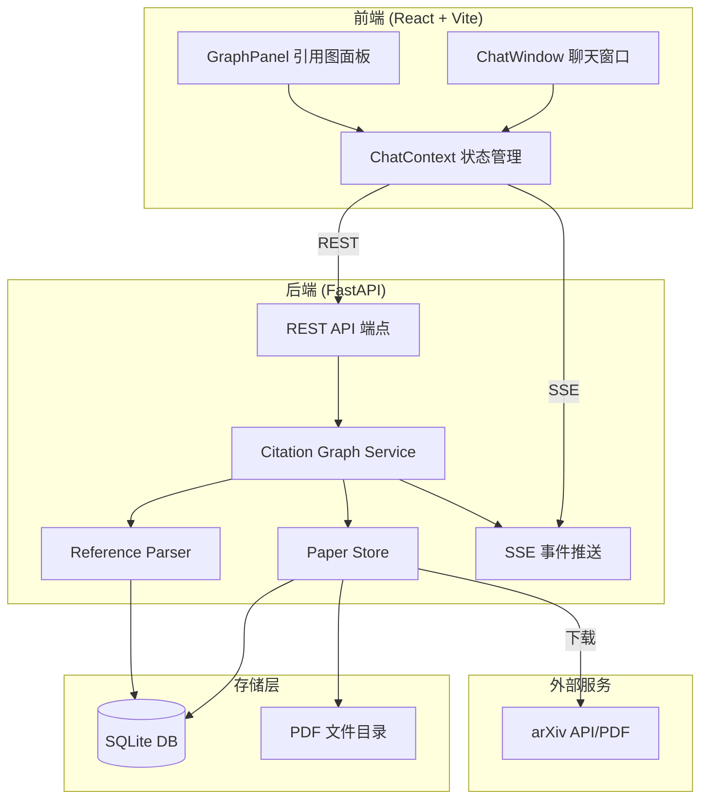
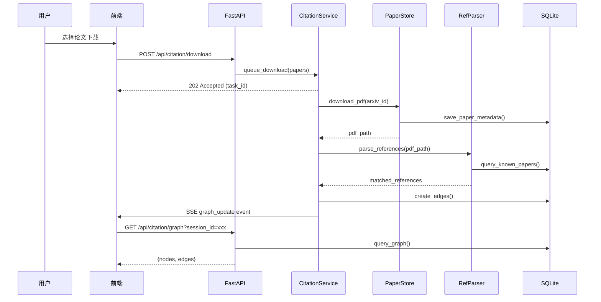

# Design Document: Paper Citation Graph

## Overview

本设计为科研智能体添加论文引用关系图功能。系统在文献调研阶段支持下载论文 PDF、解析引用关系、构建有向图数据结构，并在前端右侧可折叠面板中以力导向图可视化展示。

### 设计目标

1. **最小侵入**：新功能作为独立模块集成，不修改现有 `research_agent` 核心流程
2. **异步处理**：PDF 下载和引用解析在后台异步执行，不阻塞用户交互
3. **会话隔离**：每个研究会话维护独立的引用图数据
4. **渐进式构建**：引用图随着用户下载论文逐步扩展

### 技术选型决策

| 组件 | 选型 | 理由 |
|------|------|------|
| PDF 解析 | PyMuPDF (fitz) | 轻量、纯 Python、解析速度快、支持文本提取 |
| 图可视化 | d3-force | 项目已用 React，d3-force 可与 React 良好集成，轻量无额外框架依赖 |
| 数据存储 | SQLite（复用现有） | 项目已使用 SQLite，无需引入新数据库 |
| 标题匹配 | difflib.SequenceMatcher | Python 标准库，无需额外依赖，适合标题模糊匹配 |

## Architecture

### 系统架构图



### 请求流程



## Components and Interfaces

### 后端组件

#### 1. PaperStore (`research_agent/citation/paper_store.py`)

负责论文 PDF 的下载与本地存储管理。

```python
class PaperStore:
    def __init__(self, db_path: str, pdf_dir: str):
        """初始化存储，创建 PDF 目录和数据库表"""
        
    def download_paper(self, arxiv_id: str, title: str, authors: list[str], 
                       year: int | None, abstract: str = "") -> PaperRecord:
        """下载论文 PDF 并记录元数据。已存在则跳过下载。"""
        
    def get_paper(self, arxiv_id: str) -> PaperRecord | None:
        """按 arXiv ID 查询论文记录"""
        
    def get_papers_by_session(self, session_id: str) -> list[PaperRecord]:
        """获取会话关联的所有论文"""
        
    def link_paper_to_session(self, arxiv_id: str, session_id: str) -> None:
        """将论文关联到研究会话"""
```

#### 2. ReferenceParser (`research_agent/citation/reference_parser.py`)

从 PDF 中提取引用列表并匹配已知论文。

```python
class ReferenceParser:
    def __init__(self, db_path: str):
        """初始化解析器"""
        
    def parse_references(self, pdf_path: str) -> list[ReferenceEntry]:
        """从 PDF 提取引用列表（标题 + 作者）"""
        
    def match_references(self, references: list[ReferenceEntry]) -> list[MatchedReference]:
        """将引用条目与本地数据库中的已知论文匹配"""
```

#### 3. CitationGraphService (`research_agent/citation/graph_service.py`)

引用图的核心业务逻辑层。

```python
class CitationGraphService:
    def __init__(self, paper_store: PaperStore, ref_parser: ReferenceParser):
        """初始化服务"""
        
    async def download_papers(self, session_id: str, 
                              papers: list[PaperDownloadRequest]) -> str:
        """批量下载论文，返回 task_id。异步处理。"""
        
    def get_graph(self, session_id: str) -> CitationGraph:
        """获取会话的完整引用图"""
        
    def get_download_status(self, task_id: str) -> DownloadTaskStatus:
        """查询下载任务状态"""
```

#### 4. REST API 端点 (添加到 `server.py`)

| 方法 | 路径 | 描述 |
|------|------|------|
| POST | `/api/citation/download` | 批量下载论文 |
| GET | `/api/citation/graph` | 获取会话引用图 |
| GET | `/api/citation/status/{task_id}` | 查询下载任务状态 |
| GET | `/api/citation/paper/{arxiv_id}` | 获取单篇论文详情 |

### 前端组件

#### 1. GraphPanel (`src/app/components/GraphPanel.tsx`)

右侧可折叠面板，包含力导向图可视化。

```typescript
interface GraphPanelProps {
  sessionId: string | null;
}

// 状态管理
interface GraphState {
  nodes: PaperNode[];
  edges: CitationEdge[];
  loading: boolean;
  collapsed: boolean;
  selectedNodeId: string | null;
}
```

#### 2. ForceGraph (`src/app/components/ForceGraph.tsx`)

基于 d3-force 的力导向图渲染组件。

```typescript
interface ForceGraphProps {
  nodes: PaperNode[];
  edges: CitationEdge[];
  selectedNodeId: string | null;
  onNodeClick: (nodeId: string) => void;
  onNodeHover: (nodeId: string | null) => void;
  width: number;
  height: number;
}
```

#### 3. CitationContext (`src/app/contexts/CitationContext.tsx`)

引用图状态管理 Context。

```typescript
interface CitationCtx {
  graph: { nodes: PaperNode[]; edges: CitationEdge[] };
  loading: boolean;
  collapsed: boolean;
  downloadingPapers: Set<string>;
  togglePanel: () => void;
  downloadPapers: (papers: PaperDownloadRequest[]) => Promise<void>;
  refreshGraph: () => Promise<void>;
  selectNode: (nodeId: string | null) => void;
}
```

### SSE 事件扩展

在现有 SSE 流中添加引用图相关事件：

| 事件名 | 数据 | 触发时机 |
|--------|------|----------|
| `graph_update` | `{session_id, action: "paper_added" \| "edge_added"}` | 论文下载完成或引用边创建时 |
| `download_progress` | `{task_id, arxiv_id, status, progress}` | 下载进度更新 |
| `download_complete` | `{task_id, total, success, failed}` | 批量下载完成 |

## Data Models

### SQLite 表结构

#### papers 表

```sql
CREATE TABLE IF NOT EXISTS papers (
    arxiv_id TEXT PRIMARY KEY,
    title TEXT NOT NULL,
    authors TEXT NOT NULL,          -- JSON array
    year INTEGER,
    abstract TEXT DEFAULT '',
    pdf_path TEXT,                   -- 本地 PDF 路径
    download_status TEXT DEFAULT 'pending',  -- pending | downloading | done | failed
    created_at TIMESTAMP DEFAULT CURRENT_TIMESTAMP
);
```

#### citation_edges 表

```sql
CREATE TABLE IF NOT EXISTS citation_edges (
    id INTEGER PRIMARY KEY AUTOINCREMENT,
    citing_paper_id TEXT NOT NULL,   -- 引用方 arxiv_id
    cited_paper_id TEXT NOT NULL,    -- 被引用方 arxiv_id
    confidence REAL DEFAULT 0.0,    -- 匹配置信度 (0-1)
    created_at TIMESTAMP DEFAULT CURRENT_TIMESTAMP,
    FOREIGN KEY (citing_paper_id) REFERENCES papers(arxiv_id),
    FOREIGN KEY (cited_paper_id) REFERENCES papers(arxiv_id),
    UNIQUE(citing_paper_id, cited_paper_id)
);
```

#### session_papers 表

```sql
CREATE TABLE IF NOT EXISTS session_papers (
    session_id TEXT NOT NULL,
    arxiv_id TEXT NOT NULL,
    added_at TIMESTAMP DEFAULT CURRENT_TIMESTAMP,
    PRIMARY KEY (session_id, arxiv_id),
    FOREIGN KEY (arxiv_id) REFERENCES papers(arxiv_id)
);
```

#### download_tasks 表

```sql
CREATE TABLE IF NOT EXISTS download_tasks (
    task_id TEXT PRIMARY KEY,
    session_id TEXT NOT NULL,
    total_papers INTEGER NOT NULL,
    completed INTEGER DEFAULT 0,
    failed INTEGER DEFAULT 0,
    status TEXT DEFAULT 'running',  -- running | done | failed
    created_at TIMESTAMP DEFAULT CURRENT_TIMESTAMP
);
```

### TypeScript 类型定义

```typescript
interface PaperNode {
  id: string;           // arxiv_id
  title: string;
  authors: string[];
  year: number | null;
  abstract: string;
  downloadStatus: 'pending' | 'downloading' | 'done' | 'failed';
}

interface CitationEdge {
  source: string;       // citing paper arxiv_id
  target: string;       // cited paper arxiv_id
  confidence: number;
}

interface CitationGraph {
  nodes: PaperNode[];
  edges: CitationEdge[];
}

interface PaperDownloadRequest {
  arxiv_id: string;
  title: string;
  authors: string[];
  year: number | null;
  url: string;
}

interface DownloadTaskStatus {
  task_id: string;
  total: number;
  completed: number;
  failed: number;
  status: 'running' | 'done' | 'failed';
}
```

### Python 数据类

```python
@dataclass
class PaperRecord:
    arxiv_id: str
    title: str
    authors: list[str]
    year: int | None
    abstract: str
    pdf_path: str | None
    download_status: str  # pending | downloading | done | failed

@dataclass
class ReferenceEntry:
    title: str
    authors: list[str]
    raw_text: str  # 原始引用文本

@dataclass
class MatchedReference:
    reference: ReferenceEntry
    matched_arxiv_id: str | None
    confidence: float  # 0-1 匹配置信度

@dataclass
class CitationGraph:
    nodes: list[PaperRecord]
    edges: list[dict]  # {citing_paper_id, cited_paper_id, confidence}
```


## Correctness Properties

*A property is a characteristic or behavior that should hold true across all valid executions of a system—essentially, a formal statement about what the system should do. Properties serve as the bridge between human-readable specifications and machine-verifiable correctness guarantees.*

### Property 1: Paper metadata round-trip

*For any* valid paper metadata (arxiv_id, title, authors, year, abstract), storing it via PaperStore and then retrieving it by arxiv_id should produce an equivalent record with all fields preserved.

**Validates: Requirements 1.2, 3.5**

### Property 2: Download idempotence

*For any* paper that has already been successfully downloaded, calling download again should not trigger a new network request and should return the same local file path as the first download.

**Validates: Requirements 1.4**

### Property 3: File path determinism

*For any* valid arXiv ID, the generated local file path should be deterministic (same ID always produces same path) and follow the pattern `{pdf_dir}/{arxiv_id}.pdf`.

**Validates: Requirements 1.5**

### Property 4: Title similarity matching

*For any* reference title and a set of known paper titles in the database, the matcher should return the paper with the highest similarity score above the threshold, or None if no paper exceeds the threshold. Exact title matches should always be found.

**Validates: Requirements 2.2**

### Property 5: Edge creation for matched references

*For any* pair of papers (A, B) where paper A's reference list contains a match to paper B, a citation edge should exist from A to B in the graph, and no edge should exist from B to A (unless B also cites A independently).

**Validates: Requirements 2.3**

### Property 6: Parsed reference structure invariant

*For any* successfully parsed reference entry (non-empty parse result), the output must contain a non-empty title string and a non-empty authors list.

**Validates: Requirements 2.5**

### Property 7: Session-scoped graph completeness and isolation

*For any* two distinct sessions with their own sets of papers and edges, querying the graph for one session should return exactly the papers and edges belonging to that session, with no data leaking from the other session.

**Validates: Requirements 3.1, 3.4**

### Property 8: Connected node set correctness

*For any* node in a citation graph, the set of "directly connected" nodes should equal exactly the set of nodes that share at least one edge (incoming or outgoing) with the selected node.

**Validates: Requirements 4.4**

### Property 9: Batch download completeness

*For any* list of N paper download requests submitted as a batch, the system should create exactly N download tasks, and upon completion the task status should report total = N with completed + failed = N.

**Validates: Requirements 5.2, 5.5**

## Error Handling

### 后端错误处理

| 错误场景 | 处理策略 | 用户反馈 |
|----------|----------|----------|
| arXiv PDF 下载超时 | 重试 1 次，失败后标记 `download_status = 'failed'` | SSE 通知下载失败，显示具体 arxiv_id |
| PDF 内容无法解析 | 记录警告日志，返回空引用列表 | 论文节点正常显示，但无引用边 |
| arXiv ID 无效或 404 | 立即标记失败，不重试 | 返回错误消息说明 ID 无效 |
| SQLite 写入冲突 | 使用 WAL 模式 + 重试机制 | 对用户透明 |
| 标题匹配无结果 | 正常情况，不创建边 | 无特殊反馈，节点显示为孤立 |
| 批量下载部分失败 | 继续处理剩余，最终汇报成功/失败数 | SSE 通知完成状态含失败计数 |

### 前端错误处理

| 错误场景 | 处理策略 |
|----------|----------|
| 图数据加载失败 | 显示重试按钮，保留上次成功的图数据 |
| SSE 连接断开 | 自动重连，重连后刷新图数据 |
| 空图（无节点） | 显示引导提示："下载论文以构建引用图" |
| d3-force 渲染异常 | 捕获错误，显示降级的列表视图 |

### HTTP 错误码

| 状态码 | 场景 |
|--------|------|
| 200 | 图数据查询成功 |
| 202 | 下载任务已接受（异步处理） |
| 400 | 请求参数无效（缺少 arxiv_id 等） |
| 401 | 未认证 |
| 404 | 论文或任务不存在 |
| 500 | 服务器内部错误 |

## Testing Strategy

### 测试框架选型

| 层级 | 框架 | 说明 |
|------|------|------|
| 后端单元测试 | pytest | Python 标准测试框架 |
| 后端属性测试 | hypothesis | Python PBT 库，最少 100 次迭代 |
| 前端单元测试 | vitest + @testing-library/react | React 组件测试 |
| 前端属性测试 | fast-check | TypeScript PBT 库 |
| 集成测试 | pytest + httpx | FastAPI TestClient |

### 属性测试 (Property-Based Testing)

每个 Correctness Property 对应一个属性测试，使用 Hypothesis (Python) 或 fast-check (TypeScript) 实现。

**配置要求：**
- 最少 100 次迭代 (`@settings(max_examples=100)` / `fc.assert(..., { numRuns: 100 })`)
- 每个测试标注对应的设计属性
- 标注格式：`Feature: paper-citation-graph, Property {number}: {property_text}`

**后端属性测试 (Hypothesis)：**
- Property 1: 生成随机 paper metadata，验证存储-读取往返
- Property 2: 生成随机 paper，下载两次验证幂等性（mock 网络）
- Property 3: 生成随机 arXiv ID，验证路径确定性
- Property 4: 生成随机标题对（含已知相似度），验证匹配正确性
- Property 5: 生成随机论文对和引用关系，验证边方向正确
- Property 6: 生成随机引用文本（可解析的），验证输出结构
- Property 7: 生成两组随机论文分属不同 session，验证隔离性
- Property 9: 生成随机批次大小，验证任务完成计数

**前端属性测试 (fast-check)：**
- Property 8: 生成随机图结构，选择节点，验证连接集合正确性

### 单元测试

- PaperStore: 测试具体的下载失败场景（超时、404）、文件已存在场景
- ReferenceParser: 使用已知 PDF 样本测试解析结果
- CitationGraphService: 测试图查询、边创建的具体场景
- GraphPanel: 测试折叠/展开、tooltip 显示、badge 计数
- ForceGraph: 测试节点/边渲染、点击高亮交互

### 集成测试

- 完整下载→解析→建图流程（使用 mock arXiv 响应）
- SSE 事件推送验证
- REST API 端点响应格式验证
- 多会话并发操作隔离性验证
